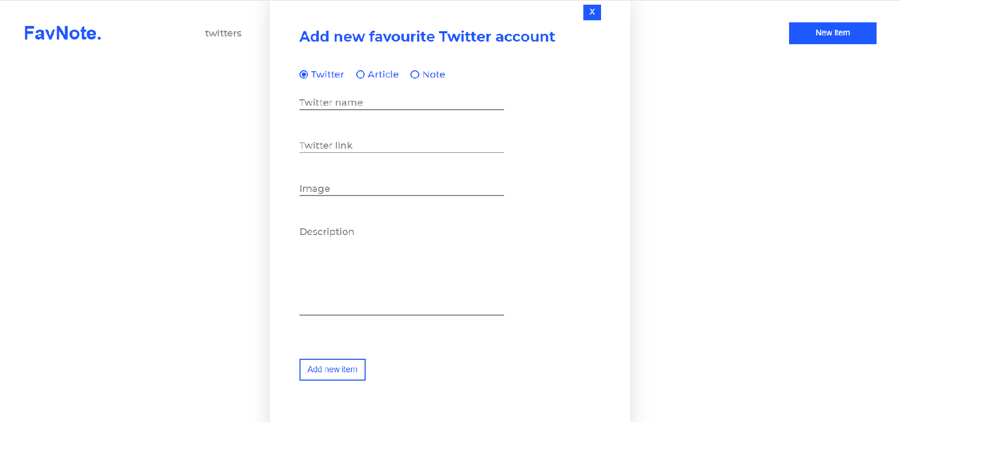
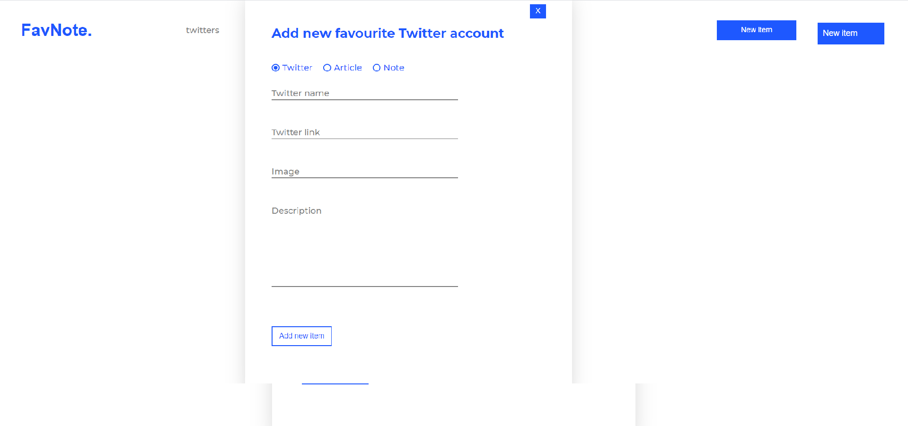

# FavNote App

FavNote is simple, interactive web application with use React.js. library.
User can add new items by form and create list of twitters, articles and notes.

## Table of contents
* [General info](#general-info)
* [Screenshots](#screenshots)
* [Technologies](#technologies)
* [Status](#status)
* [Inspiration](#inspiration)

## General info

The Motivation to create the App project was to learn React library.
Also to do something interactive and fun.

## Screenshots

## Technologies
* HTML5
* CSS3/SASS
* JavaScript (ES6)
* React.js - version 17.0.2

## Setup
link to netlify

## Status
Project is: _finished_

## Inspiration
App project is inspired by the course "React od podstaw" from Hello Roman (eduweb.pl).