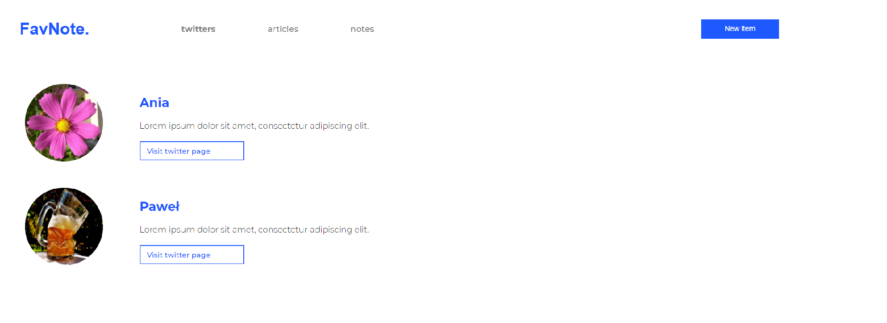

# FavNote App

FavNote is simple, interactive web application with use React.js. library. 
The Motivation to create the App project was to learn React library, also to do something interactive and fun.

## Table of contents
* [General info](#general-info)
* [Screenshots](#screenshots)
* [Technologies](#technologies)
* [Status](#status)
* [Inspiration](#inspiration)

## General info

FavNote allows the user add new items by form and create list of twitters, articles and notes. 
Application can be developed by add new features (e.g. remove notes), add form validation and create Redux store.

## Screenshots

<!-- 

 -->

## Technologies
* HTML5
* CSS3/SASS
* JavaScript(ES6)
* React.js 17.0.2
* Yarn 1.22.10
* Netlify 3.28.0

## Setup
link to netlify

## Status
Project is: _in progress_

## Inspiration
App project is inspired by the course "React od podstaw" from Hello Roman (eduweb.pl).